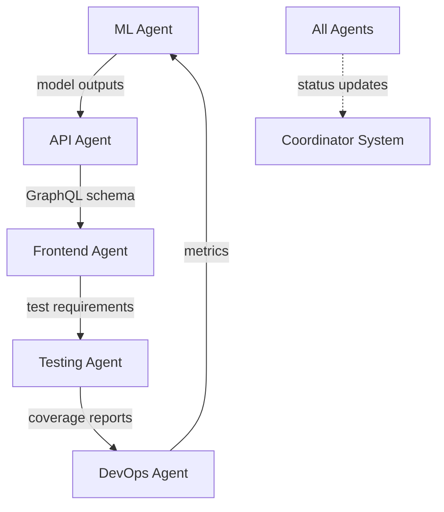

# Agent Communication Protocol

## 🤖 Inter-Agent Communication System

### Communication Channels

1. **Commit Messages**
   ```
   feat(ml): Add molecular docking algorithm
   
   AFFECTS: api, frontend
   REQUIRES: GraphQL schema update
   BLOCKS: none
   
   cc: @api-agent @frontend-agent
   ```

2. **Branch Metadata Files**
   ```yaml
   # .agent-status.yml in each branch
   agent: ml-enhancement
   status: working
   current_task: implementing_docking
   dependencies:
     - api: molecule_endpoint_v2
     - frontend: 3d_viewer_component
   next_review: 2024-01-10T15:00:00Z
   ```

3. **Shared Interface Definitions**
   ```typescript
   // shared/interfaces/molecule.ts
   interface MoleculeData {
     id: string;
     smiles: string;
     properties: MoleculeProperties;
     // @ml-agent: Add predictions field
     // @frontend-agent: Use for display
     predictions?: MLPredictions;
   }
   ```

### Coordination Commands

Agents can use special commit prefixes:

- `SYNC:` - Request synchronization with other agents
- `BLOCKED:` - Waiting for another agent
- `READY:` - Feature ready for integration
- `BREAKING:` - Breaking change warning
- `NEEDS:` - Requirements from other agents

### Example Communications

```bash
# ML Agent signals API needs
git commit -m "NEEDS(api): GraphQL mutation for batch predictions"

# Frontend agent signals ready
git commit -m "READY(frontend): 3D molecule viewer component complete"

# API agent warns of breaking change  
git commit -m "BREAKING(api): Changing prediction endpoint response format"
```

## 🔄 Automated Sync Points

Every 2 hours, agents automatically:
1. Check for NEEDS/BLOCKED messages
2. Update their .agent-status.yml
3. Resolve simple dependencies
4. Create coordination PRs if needed

## 📊 Agent Dependency Graph



## 🤝 Conflict Avoidance Rules

1. **File Ownership**
   - Check .agent-status.yml before modifying
   - Request permission via commit message
   - Wait for acknowledgment

2. **Shared Files Protocol**
   - Use feature flags for new code
   - Add without removing
   - Comment with agent identifier

3. **API Contract Changes**
   - Version new endpoints
   - Deprecate, don't delete
   - Provide migration period