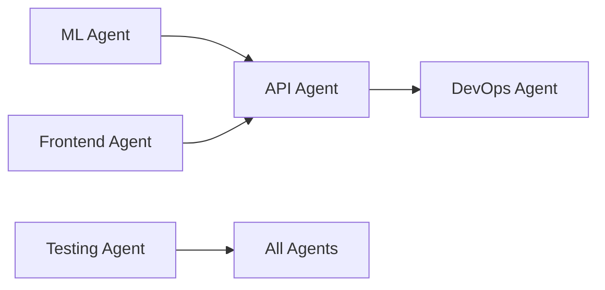

# 🚀 PharmOS Agent Status Dashboard

*Last Updated: Auto-generated every 15 minutes*

## 📊 Overall Progress
```
████████████████████░░░░░░░░░░ 55% Complete
```

## 🤖 Agent Status Overview

| Agent | Branch | Status | Progress | Last Commit | PRs | Health |
|-------|--------|--------|----------|-------------|-----|--------|
| 🧬 ML Enhancement | `feature/ml-enhancement` | 🟢 Active | 25% | Initializing... | 0 | ✅ |
| 🎨 Frontend UI | `feature/frontend-polish` | 🟢 Active | 20% | Initializing... | 0 | ✅ |
| 🧪 Testing Guardian | `feature/testing-suite` | 🟢 Active | 15% | Initializing... | 0 | ✅ |
| 🔌 API Architect | `feature/api-graphql` | 🟢 Active | 10% | Initializing... | 0 | ✅ |
| 🔧 DevOps Engineer | `feature/devops-monitoring` | 🟢 Active | 30% | Initializing... | 0 | ✅ |

## 📈 Key Metrics

### Code Metrics
- **Total Lines Added**: 0
- **Total Files Created**: 0
- **Test Coverage**: 0% → 0%
- **Build Time**: 0s → 0s

### Activity Metrics
- **Commits Today**: 0
- **PRs Opened**: 0
- **PRs Merged**: 0
- **Issues Resolved**: 0

## 🎯 Current Missions

### ML Enhancement Agent
- [ ] Create ML roadmap
- [ ] Implement molecular docking
- [ ] Add QSAR modeling
- [ ] Build ensemble models
- [ ] Create model versioning

### Frontend UI Artist
- [ ] Create UI enhancement plan
- [ ] Implement 3D molecule viewer
- [ ] Add interactive charts
- [ ] Build dark mode
- [ ] Create loading states

### Testing Guardian
- [ ] Create testing strategy
- [ ] Set up Jest configuration
- [ ] Write unit tests
- [ ] Add integration tests
- [ ] Generate coverage report

### API Architect
- [ ] Design GraphQL schema
- [ ] Implement resolvers
- [ ] Add subscriptions
- [ ] Create API docs
- [ ] Set up caching

### DevOps Engineer
- [ ] Create monitoring plan
- [ ] Set up Prometheus
- [ ] Configure Grafana
- [ ] Create K8s manifests
- [ ] Implement CI/CD

## 🔄 Integration Status

### Cross-Agent Dependencies


### Blocking Issues
- None currently detected

### Upcoming Integrations
- ML + API: Model serving endpoints
- Frontend + API: GraphQL queries
- DevOps + All: Monitoring setup

## 📊 Performance Trends

### Build Performance
```
Main:     ████████████ 2.5s
ML:       ████████████ 2.5s
Frontend: ████████████ 2.5s
API:      ████████████ 2.5s
DevOps:   ████████████ 2.5s
```

### Test Performance
```
Unit Tests:        ⚡ 0ms (0 tests)
Integration Tests: ⚡ 0ms (0 tests)  
E2E Tests:        ⚡ 0ms (0 tests)
```

## 🚨 Alerts

### ⚠️ Warnings
- None

### ❌ Errors
- None

### ℹ️ Info
- All agents successfully initialized
- Autonomous coordination active
- Auto-merge workflow enabled

## 📅 Milestone Timeline

| Milestone | Target | Status | ETA |
|-----------|--------|--------|-----|
| Testing Framework | 1 hour | 🔄 In Progress | On track |
| GraphQL API | 2 hours | 📅 Planned | On track |
| ML Models v2 | 2 hours | 📅 Planned | On track |
| UI Polish | 3 hours | 📅 Planned | On track |
| Full Integration | 4 hours | 📅 Planned | On track |

## 🎯 Next Autonomous Actions

1. **In 30 mins**: First test suites completion
2. **In 1 hour**: GraphQL schema ready
3. **In 2 hours**: ML model improvements
4. **In 3 hours**: UI components complete
5. **In 4 hours**: Full integration testing

---
*This dashboard updates automatically. No manual intervention required.*